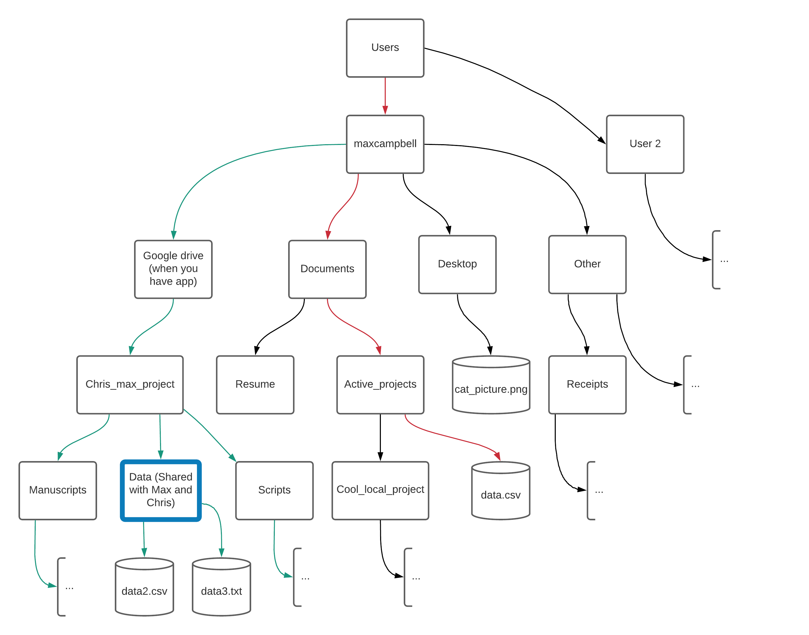
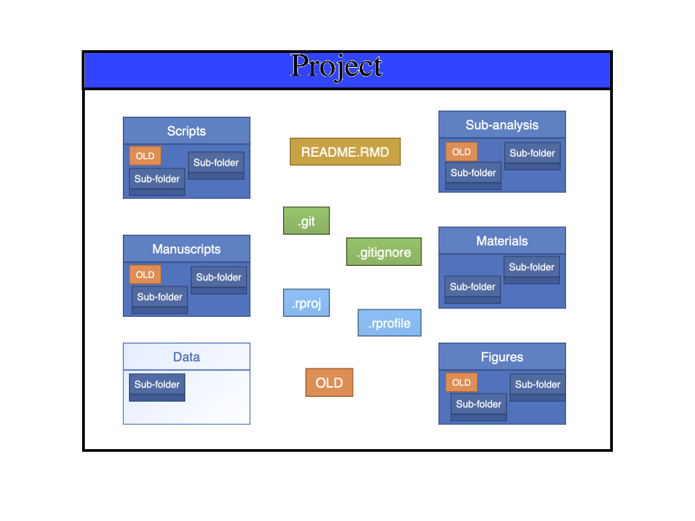

# The general framework from collaboration in the Seascape models Lab

Max Campbell, Chris Brown

## The Motivation

This framework was designed for the seascape model lab to be able to collaborate across multiple projects with a consistent and coherent structure. To be able to effective use this framework you need to have a basic idea of git, GitHub, folder directories and Google Drive (if you are not understanding this structure you likely have a gap in your knowledge in one of these key areas). 

The figure below contains the understanding necessary to use this framework. You should be able to understand every piece of information (compartments, arrows, labels). If you don’t understand something, ask someone who is familiar with the framework. In short, orange box lives only the internet, purple box lives on the internet and maybe somewhere else if working offline, and the blue boxes can live anywhere (but we recommend they live on the google drive too). The green arrows indicate transfer of information. Note that GitHub and Google Drive are not connected in any way (and they operate completely independently). **NEVER** share your user folder with another user whom is connected to the GitHub repository or you may **LOSE YOUR DOCUMENTS OR CODE**.


## TODO List

* Get Chris to check over this document
* Run the framework past Eric


## Google drive (storing data)

We assume that you have a basic understanding of how google drive works. But in short, it is a cloud-based storage that works very similar to a giant USB drive which is backed up online. The trickiest part of using google drive is making sure that you are set up properly on your personal computer ([read here]( https://support.google.com/drive/answer/7329379#zippy= )). After this is done it should work just the same as any other directory (folder structure) with a few extra Google drive options.

* Suggest you save project here along with data, but **ONLY SHARE THE DATA**.
* Students and Staff seem to have unlimited Google drive storage until further notice.


## Git

Git is something known as “version control” system. In short, this system saves old versions of your project, text, and code. For a beginner user it is sufficient for you to just check that you have at .git file in your project directory, if you do, you don’t need to worry about anything further. Each project needs its own .git file and this should be located at the highest level in the project directory.


## GitHub

This is different to Git. Instead this a cloud-based storage system that stores the contents of your Git repository online (**MAKE SURE YOU HAVE THE REPOSITORY SET TO PRIVATE IF DESIRED**). Our lab, interacts with the content of the GitHub in two ways, using the desktop app and using GitHub in your web browser.

You also need to ensure that you have a GitHub premium account (this is free for students).

Maximum file size is 100mb. Recommend that entire project is less than a 1gb (use private folders or OLD – see explanations in Directory Templates section)

You need to be able understand and do the following by yourself.

* Commit – Save changes of your project to .git file in your local computer/cloud directory
* Push – Send changes to GitHub so others can access them and update their project version
* Pull – Update the project on your local computer/cloud directory with changes others have send to GitHub 
* Clone – Bring an already existing project down to your local computer/cloud directory (you would do this when joining or continuing someone else’s project)
* Invite – Add another user to your project so they can make edits, join or continue with your progress.


## Directories

Directories are hierarchical entirely in structure (folders in folder in folders), but shortcuts allow you to jump between paths. There are some differences in the general directory structure of MAC and Windows, so you need to be aware of the ones relevant to your operating system (see below for details). The main thing you need to understand here is the structure of a directory. We stress on proper usage of sub-folders (do it smart not lazy so directories are easy for another user to understand).


#### MAC
Your main folders and files should stem from the Users folder. You can navigate through the directory using the “/” operator. For example, “/Users/maxcampbell” is the location of the base directory for the user “maxcampbell”, further if we want to go lower in the directory “/Users/maxcampbell/Documents” will take into the “Documents” folder of this user “/Users/maxcampbell/Documents/Active_projects” into the “Active_projects” folder within the “Documents” folder of the user. Finally, if wanting to refer to the data saved as at csv file in the “Active_projects” folder we use “/Users/maxcampbell/Documents/Active_projects/data.csv”.  And you should be able to access any file on your computer using this method (including a folder on Google Drive, after you have the Google Drive app).


#### Windows
Your main folders and files should stem from the Users folder. You can navigate through the directory using the “\\” operator. For example, “C:\\Users\\maxcampbell” is the location of the base directory for the user “maxcampbell” , further if we want to go lower in the directory “C:\\Users\\maxcampbell\\Documents” will take into the “Documents” folder of this user “C:\\Users\\maxcampbell\\Documents\\Active_projects” into the “Active_projects” folder within the “Documents” folder of the user. Finally, if wanting to refer to the data saved as at csv file in the “Active_projects” folder we use “C:\\Users\\maxcampbell\\Documents\\Active_projects \\data.csv”.  And you should be able to access any file on your computer using this method (including a folder on Google Drive, after you have the Google Drive app).




## Documenting changes

One of the most crucial parts of collaboration is documenting the relevant project information. We do this in two ways using the Materials folder and IMPORTANTLY using a README file. The Materials folder contains interesting content that you have found or made (such as excel spreadsheets, bits of writing, key emails, papers, etc.). Whereas the README file has a summary of the most important project information (you could pretty much copy this in the methods sections of a manuscript as a starting point). Another KEY part of a README file is that it contains a TODO (to do list) at the very beginning so it is easy for you or someone else to pick up a project where you have left off. This README file should be an .md file so we can easily view it on GitHub.

Often, we think of recording metadata (project information) as being a painful exercise and we often tend not to do enough of it. So, my tip would be UPDATE THE TODO SECTION OF THE README EVERYTIME before leaving the project for any reasonable period of time, this will take a short period of time and save you and your colleagues many hours of confusion in the long run. And additionally, update the rest of the README every now and again, when you are feeling motivated (this will pay off when it comes to writing the paper).

You can edit the README.md in any text editor, though I like R studio.


## Directory templates

Several templates have been made for your convenience, access them [here](https://drive.google.com/drive/folders/1dCdiRN_8FS5AD5XSGm9nlPYaxtmwZXSE?usp=sharing) (descriptions on contents below).

The project folders contain some of the following (with description):
* README.MD (standardised Rmarkdown file – see Documenting Changes section)
* Manuscripts/ (folder to store your project manuscripts)
* Materials/ (folder to store meta data and useful writing)
* Data/ (folder to store all data. This should live on the cloud and be shared with collaborators)
* Figures/ (folder to store figures from analysis or other)
* OLD/ (folder to chuck OLD stuff in found in several directories)
* Private/ (Things you do NOT want to end up on github or share with other users, e.g. large files, personal files etc.)
* .git (hidden file which does version control)
* XYZ.rproj (open R by clicking on this, which sets working directory in R)
* .rprofile (hidden file, to change if data lives elsewhere – see Advanced usage)
* .gitignore (hidden file tell the .git file what should be recorded and should be shared online through GitHub – see gitignore for further details) 




## Compatibility with R

This framework was designed to work particularly well with R, but will also work well with other programming languages.
 
* Use R projects for convenience
* Understand how to change work directories easily in R
* Personalised .Rprofiles to find the data if in different location to scripts (e.g. the spatial drive), see advanced section below


## How to do...

#### Starting a new project

1. Copy paste the desired project folder from the “seascape_collaboration folder” to the desired location on your machine (recommend this is on the google drive directory) and rename both the folder and the Rproject. And put files in relevant locations.
2. Link to GitHub, MAKE SURE YOU MAKE A PRIVATE REPOSITORY IF REQUIRED
3. Invite collaborators to join project on GitHub
4. Share data with collaborators from google drive
5. Update the README.MD
6. DONE

#### Joining someone’s project (cloning)

1. Accept invitation to join repository on GitHub
2. Open the GitHub desktop app and clone the repository to the desired location 
3. Add the shared data from google drive to the desired location
4. DONE

### Project workflow (from GitHub desktop App)

1. Click “fetch origin” to get the most up to date version of the project from GitHub (Pull request)
2. Make changes to the project just as you would on your local machine
3. Commit changes after filling out the summary description boxes.
4. Push changes back up to GitHub
5. DONE


## How to collaborate outside of the lab

TBA ...

* What to share etc.
* What not to share


## Other tips and tricks

* Use “_” instead of space in folder names
* Have your OS display hidden files
* Get a spell checker for Rstudio

## Advanced usage

#### R markdown and HTML

TBA ...

#### LATEX compatibility in R markdown

* Mathematics equations are great

#### .gitignore

.gitgnore files are to stop git from commiting files with certain extensions. These files will never be synced online. You can change this file if desire. To understanding the patterns ignored in the git file [read here](https://git-scm.com/docs/gitignore).

#### Git branches
These allow you to make changes to the project that you may or may not want to include in the future (think of them as the same project in a parallel universe). The big downside is that it is that you need to have a fairly good understanding of GitHub to use and that it becomes more difficult to predict how changes on the main project will be integrated with the branch in the future.
* Don’t recommend using these unless you know what you are doing 
* They can be really useful if you want to trial substantial changes that you will want to keep or not in the future
* Or if you want to take several directions on the same project

#### Storing data somewhere else such as the spatial drive

If using R: 
Write a function in the project .Rprofile file the adds the appropriate working directory to a file path. The .Rprofile is run when you open the project so you will always have access to the function if you opened the R project.

Function below to add extention to filepath x (e.g. x = “Data/data.csv”). Check Sys.info()["user"] for your computers user.

```r
mpath <- function(x){
  
  if (Sys.info()["user"] == "maxcampbell"){
    max_ext <- "/Volumes/GoogleDrive/My Drive/tuna-bycatch-study/TNC Tuna Project/"
  } else if (Sys.info()["user"] == "s2989645") {
    max_ext <- "C:/Users/s2989645/Google Drive/tuna-bycatch-study/TNC Tuna Project/"
  } else if (Sys.info()["user"] == "ameliadesbiens") {
    max_ext <- "/Users/ameliadesbiens/Google Drive/tuna-bycatch-study/TNC Tuna Project/"
    } else {
      max_ext <- ""
  }
  
  paste0(max_ext, x)
  
}
```

If using another Program:
Set the appropriate working directory in the program (could use a similar function to above R version easily enough).

## Options (unresolved)

Google drive or Onedrive: I recommend google drive from limited reading, because apparently Onedrive occasionally mixes file (which would really suck!).

## Current limitations

* Naming convention of folders allows for potential problems with sharing the incorrect data and or files, and makes it easy to overwrite files


