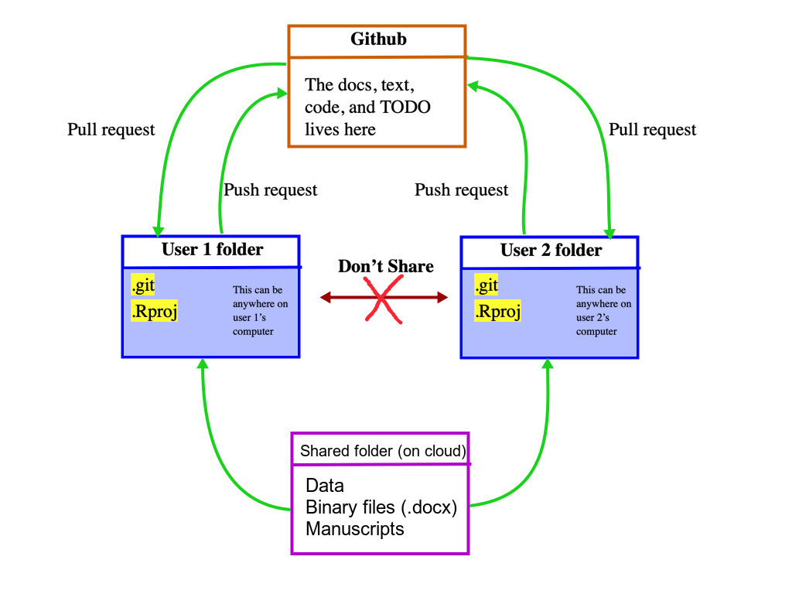

# The general framework for collaboration in the seascape models lab (SCF)

Max Campbell, Chris Brown, Christina Buelow

## Quick links

[Get directory template](https://drive.google.com/drive/folders/1dCdiRN_8FS5AD5XSGm9nlPYaxtmwZXSE?usp=sharing)

[Quick how to guides](/tips-and-guides.md)


## The Motivation

This framework (SCF) was designed for the seascape models lab to be able to collaborate across multiple projects with a consistent and coherent structure. To effectively use this framework you need to have a basic idea of git, GitHub, folder directories and cloud based storage (Google Drive or Dropbox). We can teach you if you don't.  

The figure below explains the framework. Ask us if its not clear.

The orange box lives only the internet, purple box lives on the internet (Google drive, Dropbox, etc.) and maybe somewhere else if working offline (suggest you use syncing of cloud to handle this), and the blue boxes can live anywhere (but we recommend they live in the same location as purple box too). The green arrows indicate transfer of information/files/data. Note that GitHub and cloud storage are not connected in any way (and they operate completely independently). **NEVER** share your user folder with another user whom is connected to the GitHub repository or you may **LOSE YOUR DOCUMENTS OR CODE**. Instead share only the "Shared" folder (purple box) with collaborators. The "Shared" folder has a central role in this framework in that is stores and backs ups sub folders "Data" and "Manuscripts" (and their contents), as well as binary type files (e.g. .xlsx, .docx), which are not handled well by GitHub (not that only your cloud based storage is your backup here).



## TODO List

* Present to lab @maxcampb
* Workshop at GC
* Online workshop?
* Ensure that everyone is familiarised with the framework


## Cloud storage (Google Drive)

We recommend that you use Google Drive as the default because it is free with the university and popular, thus it is likely that all your collaborators will have access. This is not a requirement and you are free to use a system of your choice (Dropbox, Research Drive or onedrive), however, it is your responsibility to ensure that all collaborators have access to the cloud storage system you use.

Google drive is a cloud-based storage that works very similar to a giant USB drive which is backed up online. The trickiest part of using google drive is making sure that you are set up properly on your personal computer ([read here]( https://support.google.com/drive/answer/7329379#zippy= )). After this is done it should work just the same as any other directory (folder structure) with a few extra Google drive options.

* Suggest you save project here along with "Shared" folder (containing Data, Manuscripts, and Binary files), but **ONLY SHARE THE "Shared" FOLDER**.
* Students and Staff seem to have unlimited Google drive storage until further notice.


## Git

Git is a “version control” system. This system saves old versions of your project, text, and code. For a beginner user it is sufficient for you to just check that you have at .git file in your project directory, if you do, you don’t need to worry about anything further. Each project needs its own .git file and this should be located at the highest level in the project directory.

The .git file keeps track of all the changes made to each file in the folder, so you can 'go back in time' and recover old versions.


## GitHub

Github is a cloud-based storage system that stores the contents of your Git repository online (**MAKE SURE YOU HAVE THE REPOSITORY SET TO PRIVATE IF DESIRED**). Our lab, interacts with the content of the GitHub in two ways, using the desktop app and using GitHub in your web browser.

You also need to ensure that you have a GitHub premium account (this is free for students).

Maximum file size is 100mb. Recommend that entire project is less than a 1gb (use private folders or OLD – see explanations in Directory Templates section)

You need to be able understand and do the following by yourself.

* Commit – Save changes of your project to .git file in your local computer/cloud directory
* Push – Send changes to GitHub so others can access them and update their project version
* Pull – Update the project on your local computer/cloud directory with changes others have send to GitHub
* Clone – Bring an already existing project down to your local computer/cloud directory (you would do this when joining or continuing someone else’s project)
* Invite – Add another user to your project so they can make edits, join or continue with your progress.


## Directories and files

Directories are hierarchical structures for storing information (folders in folder in folders). Shortcuts allow you to jump between paths. There are some differences in the general directory structure of MAC and Windows, so you need to be aware of the ones relevant to your operating system (see below for details). The main thing you need to understand here is the structure of a directory. We stress on proper usage of sub-folders (do it smart not lazy so directories are easy for another user to understand).

### MAC or Linux
Your main folders and files should stem from the Users folder (home for Linux users). You can navigate through the directory using the “/” operator. For example, “/Users/maxcampbell” is the location of the base directory for the user “maxcampbell”, further if we want to go lower in the directory “/Users/maxcampbell/Documents” will take into the “Documents” folder of this user “/Users/maxcampbell/Documents/Active_projects” into the “Active_projects” folder within the “Documents” folder of the user. Finally, if wanting to refer to the data saved as at csv file in the “Active_projects” folder we use “/Users/maxcampbell/Documents/Active_projects/data.csv”.  And you should be able to access any file on your computer using this method (including a folder on Google Drive, after you have the Google Drive app).

### Windows
Your main folders and files should stem from the Users folder. You can navigate through the directory using the “\\” operator. For example, “C:\\Users\\maxcampbell” is the location of the base directory for the user “maxcampbell” , further if we want to go lower in the directory “C:\\Users\\maxcampbell\\Documents” will take into the “Documents” folder of this user “C:\\Users\\maxcampbell\\Documents\\Active_projects” into the “Active_projects” folder within the “Documents” folder of the user. Finally, if wanting to refer to the data saved as at csv file in the “Active_projects” folder we use “C:\\Users\\maxcampbell\\Documents\\Active_projects \\data.csv”.  And you should be able to access any file on your computer using this method (including a folder on Google Drive, after you have the Google Drive app).


### Naming files and Directories

For tips on naming things we follow similar [Jenny Bryan's naming protocol.](http://www2.stat.duke.edu/~rcs46/lectures_2015/01-markdown-git/slides/naming-slides/naming-slides.pdf)

This includes:
* Using logical order where possible (e.g. start with "001_" to signal step 1, and  "002_" to signal step 2.) rather than chronological order (because dates they have to be constantly be updated and are not very human-readable). Chronological order are fine too but make sure you use the "YYYY-MM-DD" form. 
* Descriptive names
* Using "-" and "_" to separate words
* No special characters
* "**-v2**.csv" style to signal new versions and count up numerically (throw old ones in the OLD folder)


## Documenting changes

One of the most crucial parts of collaboration is documenting the relevant project information. We do this in two ways using the Materials folder and IMPORTANTLY using a README file. The Materials folder contains interesting content that you have found or made (such as excel spreadsheets, bits of writing, key emails, papers, etc.). Whereas the README file has a summary of the most important project information (you could pretty much copy this in the methods sections of a manuscript as a starting point). Another KEY part of a README file is that it contains a TODO (to do list) at the very beginning so it is easy for you or someone else to pick up a project where you have left off. TODOs act as a guide on what needs to be done to progress this project to the next level. The README file should be an .md file so we can easily view it on GitHub.

Often, we think of recording metadata (project information) as being a painful exercise and we often tend not to do enough of it. So, my tip would be UPDATE THE TODO SECTION OF THE README EVERY TIME before leaving the project for any reasonable period of time, this will take a short period of time and save you and your colleagues many hours of confusion in the long run. And additionally, update the rest of the README every now and again, when you are feeling motivated (this will pay off when it comes to writing the paper).

You can edit the README.md in any text editor, though I like R studio or VSCode.


## Using issues

GitHub issues allow us to be able to keep track of things that need to be resolved, record potential bugs and highlighting document checks needed, while assigning responsibility to the task to one more person. These issues are a good place to have discussion on a particular issue by using commenting (this way we can keep track of the juicy details). The can easily be used to mark and reference particular lines of code ([see guides](/tips-and-guides.md))

These should be written directly in GitHub.com (COMMAND + I in the desktop app) or on the mobile app.


### Assignees

An Assignee is a person whom is currently in charge of progressing an issue. There can be multiple assignees per issue, however try to keep the number of assignees to a minimum. The assignee/s may change over the course of a project. If you can no longer progress an issue yourself MAKE SURE you change the assignee/s (if you are the only current assignee). There should NEVER be zero assignees on an issue.

When creating a new issue, you NEED to delegate at LEAST 1 assignee, whom is in charge of making sure that this issue is addressed (if unsure who to assign, assign yourself). Make sure you notify the assignee/s of issue if you delegate them as an assignee and the issue is "highpriority" labelled. 

### Other important details when using issues

* Add relevant labels including at least ONE of the following: lowpriority (can be done whenever is convenient), mediumpriority (should be done this week or next), highpriority (NEEDs to be done ASAP), currentlysolved (doesn't require any further attention at this stage) or wontfix (will never fix this issue).
* You can mention someone in an issue if you would like their input using "\@username", however USE THIS SPARINGLY because it will fill up their notifications.
* You can make a checkbox in the issue or comment use using "- [ ]"


## Using discussions

In addition to using issues we use discussions. Where important distinction between an issue and a discussion is that issues are tasks assigned to individuals or groups which are expected to be completed, while participation in discussion is welcomed but not essential. Think of discussions as a way to share thoughts, get help, help others and network. The advantages are:

* Not having to answer the same questions multiple times (people can be referred to the discussion)
* Efficient usage of lab expertise
* Great way to learn passively and actively
* Easy way to get feedback
* Networking opportunity

Please follow the guidelines below when participating in discussions, and use the following flow chart.

### Discussion guidelines

Please adhere to the following when using discussions.
* First diagnose whether this material is appropriate for a discussion using Figure 3.
* Do not tag or target other users in the discussion (if you want someone specific to answer ask them politely on teams).
* Never put down others.
* Make SURE you mark as answered after you question has been answered, to avoid wasting other users time. And do NOT delete discussions after they have been answered, because they may inform other users.
* Upvote and like good responses.
* We encourage answers from everyone because they give us a chance to learn, however, please attach a level of certainty to your response on a scale of 1-10 (where 1, 5, 10 are 10%, 50%, and 100% sure respectively). For example a response might be "That you sea surface temperature is the most important factor according to the literature (6/10)." or "Use an ANOVA not Kruskal Wallace test because your residuals are normally distributed (8/10)."
* Do not ask about personal matters here.
* Make sure that the questions are self contained (have adequate information contained to solve).
* Make sure your answers contain enough detail to make sense.


### Other types of discussions

**Q&A:** These are the main type of discussion and should have solution.

**Announcements:** These are lab wide announcements, that should be read by everyone.

**General:** These are general back and forth discussions that have no clear answer. For example, discussing how to respond to reviewer comments, how to interact with an organisation or professional advice.

**Ideas:** These can be used to discuss future direction of research or improve projects.

**Show and tell:** These are for communicating something you have learn to the lab.


## Directory templates

Several templates have been made for your convenience, access them [here](https://drive.google.com/drive/folders/1dCdiRN_8FS5AD5XSGm9nlPYaxtmwZXSE?usp=sharing) (descriptions on contents below).

The project folders contain some of the following (with description):
* README.MD (standardised Rmarkdown file – see Documenting Changes section)
* Scripts/ (folder to store code scripts)

* Materials/ (folder to store meta data and useful writing. This will be on GitHub so consider using files that are not binary (e.g. .MD, .RMD, .CSV, .txt, .html, etc.), otherwise, you Git repo will bet very large (which will slow the system a lot).
* Materials/Outputs/ (folder to store figures or outputs you want to use or back up on GitHub from analysis or other - note these can make repository very large so consider "Shared/Outputs/" folder (do not make this your default place for figures))

* Shared/ (folder to store all data, manuscripts, outputs, and binary files. This should live on the cloud and be the **ONLY** shared with collaborators, It will also not be on GitHub)
* Shared/Data/ (folder to store all data, will not be on GitHub)
* Shared/Manuscripts/ (folder to store your project manuscripts, will not be on GitHub)
* Shared/Outputs/ (folder to store all data, will not be on GitHub)

* OLD/ (folder to chuck OLD stuff in found in several directories, these folders are not on GitHub)
* Private/ (Things you do NOT want to end up on GitHub or share with other users, e.g. large files, personal files etc.)
* .git (hidden file which does version control)
* XYZ.rproj (open R by clicking on this, which sets working directory in R)
* .rprofile (hidden file, to change if data lives elsewhere – see Advanced usage)
* .gitignore (hidden file tell the .git file what should be recorded and should be shared online through GitHub – see gitignore for further details)


## Compatibility with R

This framework was designed to work particularly well with R, but will also work well with other programming languages.

* Use R projects for convenience
* Understand how to change work directories easily in R
* Personalised .Rprofiles to find the data if in different location to scripts (e.g. the spatial drive), see advanced section below

## Using the mobile app

This application lets you look at code, issues and get notifications. You can also create new issues from your phone, however, some functionally seems to be reduced. Either way its cool so give it a GO!


## Tips and guides

[Quick how to guides](/tips-and-guides.md), which includes:

* Starting a new project
* Joining someone’s project (cloning)
* Project workflow (from GitHub desktop App)
* Creating and removing an issue
* Mark and show lines of code within an issue
* Converting existing projects to the framework
* General tips

## Advanced usage

### Markdown and HTML

* Learn how to use markdown, [here are some tips](https://rmarkdown.rstudio.com/lesson-1.html)
* For code write using:

\`\`\`r

My r code here

\`\`\`


### LATEX compatibility in R markdown and markdown

* Mathematics equations are great in LateX see guide [here](https://oeis.org/wiki/List_of_LaTeX_mathematical_symbols)
* Can use them directly in markdown with "\$$ your latex for separate line $$" or "\$ your latex for inline $"
* If wanting to use in GitHub discussions need chrome attachment [purple pi](https://github.com/nschloe/purple-pi)

### Ignoring files with .gitignore

.gitignore files are to stop git from committing files with certain extensions. These files will never be synced online. You can change this file if desire. To understanding the patterns ignored in the git file [read here](https://git-scm.com/docs/gitignore).

### Git branches
These allow you to make changes to the project that you may or may not want to include in the future (think of them as the same project in a parallel universe). The big downside is that it is that you need to have a fairly good understanding of GitHub to use and that it becomes more difficult to predict how changes on the main project will be integrated with the branch in the future. 

* Do not recommend using these unless you know what you are doing
* They can be really useful if you want to trial substantial changes that you will want to keep or not in the future
* Or if you want to take several directions on the same project

If you are interested here is an issue on the flow structure we would probably use contents of issue [#32].

### Storing data somewhere else such as the spatial drive

If using R:
Write a function in the project .Rprofile file the adds the appropriate working directory to a file path. The .Rprofile is run when you open the project so you will always have access to the function if you opened the R project.

Function below to add extension to file path x (e.g. x = “Data/data.csv”). Check Sys.info()["user"] for your computers user.

```r
mpath <- function(x){

  if (Sys.info()["user"] == "maxcampbell"){
    max_ext <- "/Volumes/GoogleDrive/My Drive/tuna-bycatch-study/TNC Tuna Project/"
  } else if (Sys.info()["user"] == "s2989645") {
    max_ext <- "C:/Users/s2989645/Google Drive/tuna-bycatch-study/TNC Tuna Project/"
  } else if (Sys.info()["user"] == "ameliadesbiens") {
    max_ext <- "/Users/ameliadesbiens/Google Drive/tuna-bycatch-study/TNC Tuna Project/"
    } else {
      max_ext <- ""
  }

  paste0(max_ext, x)

}
```

If using another Program:
Set the appropriate working directory in the program (could use a similar function to above R version easily enough).

